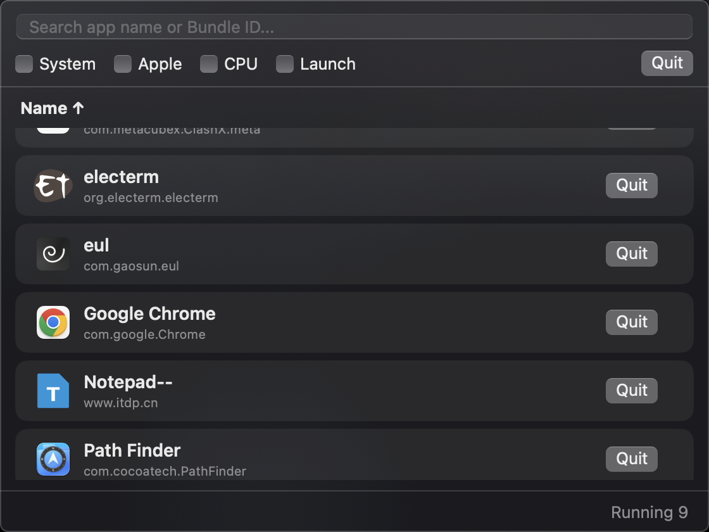

# BarTool

A clean and beautiful macOS menu bar app manager.

## Preview



---

# Features

## App Management

- View running applications
- Search apps
- Bundle ID display
- Sort by app name
- Double-click to activate app
- One-click Quit

---

## Performance Monitoring

Optional display:

- CPU usage
- Memory usage

Supports sorting:

- CPU sorting
- Memory sorting

---

## Filters

Supports:

- Hide system processes
- Hide Apple apps
- Search app names
- Search bundle IDs

---

## Launch at Login

Implemented using:

```swift
SMAppService.mainApp.register()
```

---

## UI

- Native macOS style
- Blur / dark translucent UI
- Retina icon support
- MenuBarExtra window mode

---

## Requirements

- macOS 13+
- Intel / Apple Silicon

---

## Installation

Download the latest release from the Releases page.

---

## Notes

If macOS blocks the app:

1. Right click the app
2. Click Open
3. Confirm Open
